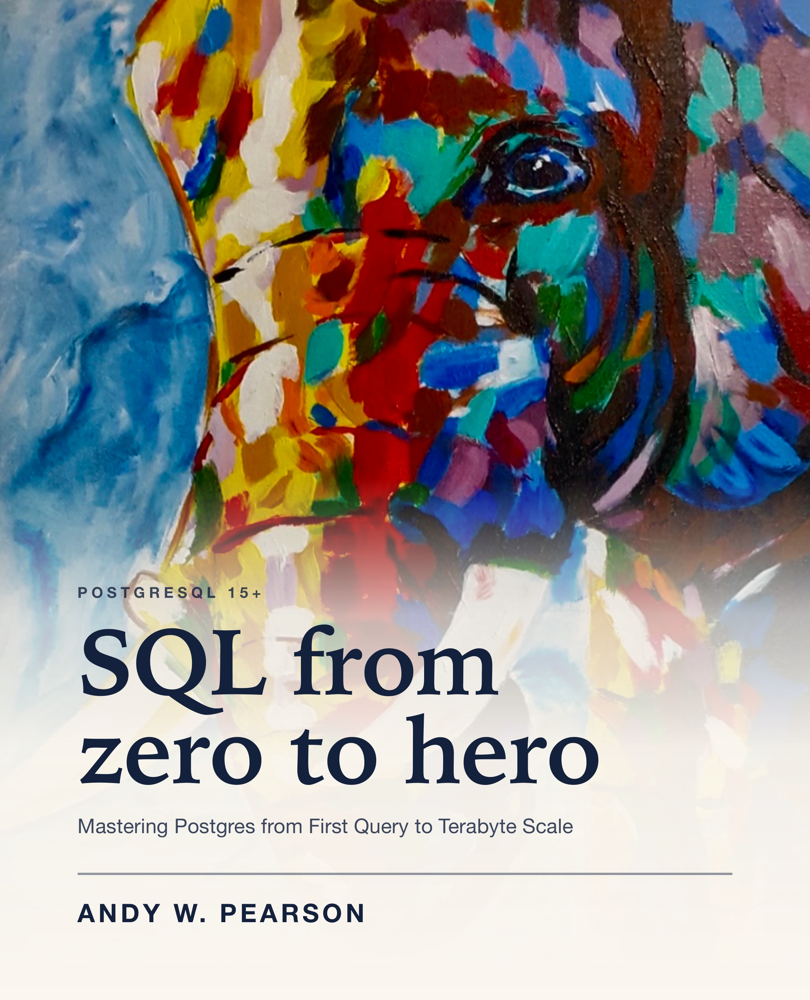

# SQL from Zero to Hero
### Mastering Postgres from First Query to Terabyte Scale

By **Andy W. Pearson** — the combined pen name of three authors.

A comprehensive PostgreSQL book taking readers from their first `SELECT` to diagnosing
production incidents on terabyte-scale clusters. 54 chapters across 12 parts, with
roughly 180 hands-on practice sessions.

---

## Repository Layout

```
sql-from-my-heart/
├── README.md            this file — plan and progress
├── CONVENTIONS.md       binding writing rules; read before drafting any chapter
├── TOC.md               the full table of contents
├── manuscript/          chapter drafts, one file per chapter
│   ├── 00-front-matter/
│   ├── part-01-foundations/ … part-12-capstone/
│   └── 99-appendices/
├── datasets/            retail / telemetry / hr sample data + load scripts
└── cover/cover.html     live cover mockup (open in a browser, drop the painting in)
```

## Building the Book

```bash
./book.sh serve    # browsable site with search + nav at http://localhost:3000
./book.sh build    # static site into .book-out/
./book.sh pdf      # whole book -> SQL-from-zero-to-hero.pdf
```

Requires `mdbook` (`brew install mdbook`) and Google Chrome, which is used headlessly to
print the PDF — no LaTeX needed. `book.sh` generates `.book-src/SUMMARY.md` from the
`manuscript/` layout each run, so adding a chapter file is all that is needed for it to
appear; part directories with no chapters yet are skipped. Part titles are mapped in
`part_title()` inside `book.sh`.

Both `.book-src/` and `.book-out/` are generated — do not edit them.

## Prerequisites for Readers

- macOS or Linux
- PostgreSQL 15 or newer
- A terminal and `psql`

## Progress

| Part | Chapters | Status |
|------|----------|--------|
| Front matter | Preface, How to Use This Book | drafted |
| I — Foundations | 1–3 | **done** — SQL verified on 15.10 (ch 2 install steps unverifiable by nature) |
| II — Core SQL | 4–8 | **done** + verified |
| III — Combining Data | 9–12 | **done** — re-verified 2026-09-14, every SQL block re-run · 12 minor items in `ERRATA-OPEN.md` |
| IV — Data Types and Integrity | 13–17 | **drafted** + verified · 12 `BENCHMARK-TODO` markers awaiting measurement on an idle box |
| V — Enterprise Design | 18–24 | **drafted** + independently re-run 2026-09-30 · chapters run 4,700–6,400 words: over house length because of pasted output |
| VI — Advanced Querying | 25–28 | **drafted** + independently re-run 2026-09-30 · 3,950–4,160 words each |
| VII — Transactions and MVCC | 29–32 | **drafted** + independently replayed 2026-09-30 · 3,980–4,288 words each |
| VIII — Performance Engineering | 33–40 | not started |
| IX — Programmability | 41–43 | not started |
| X — Administration | 44–49 | not started |
| XI — Applications at Scale | 50–53 | not started |
| XII — Capstone | 54 | not started |
| Workbook | exercises/ | 88 sessions across ch 1–32 |
| Appendices | A–I | not started |

**Datasets:** done and verified on PostgreSQL 15.10. `./load.sh all sm` loads
`retail` (9,950 rows), `telemetry` (10,000) and `hr` (9,835) in about a second. Large
variants total ~20.8M rows / 3.5 GB in ~2 minutes. Small data is deterministic, so
printed output in the manuscript matches what readers see.

## Working Agreement

1. `CONVENTIONS.md` governs. Read it before drafting.
2. Chapter 1 is the style exemplar. Match its structure and register.
3. Every SQL snippet must be executed against a real PostgreSQL 15+ instance before the
   chapter is marked drafted. Nothing ships unverified.
